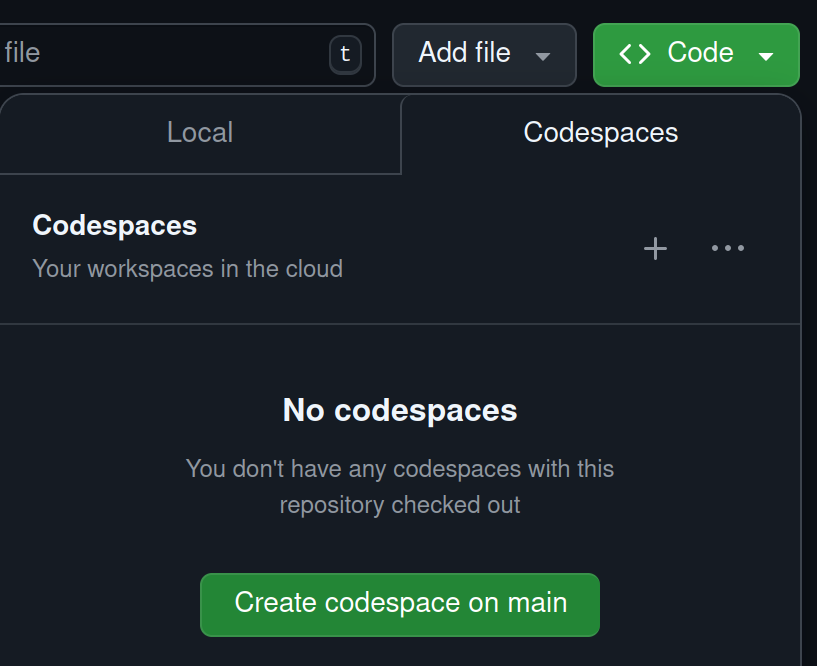
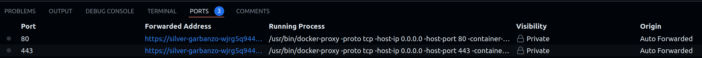

# Github codespaces
The k8s-escape-room can be played within a [Github codespaces](https://github.com/features/codespaces) environment.

Depending on the account, [Github offers an amount of free hours per month](https://docs.github.com/en/billing/managing-billing-for-github-codespaces/about-billing-for-github-codespaces) to run codespaces.


## Requirements
[Create codespace](https://github.com/codespaces/new?template_repository=steadforce/k8s-escape-room)
(2-core machine type is sufficient)

or alternatively via



kind network
```bash
docker network create --driver=bridge --subnet=10.172.242.0/24 --ip-range=10.172.242.0/28 --gateway=10.172.242.1 kind
```

**Hint**

If TLS timeout happens e.g. on image pulls there might be a mtu mismatch between the kind network and e.g. a VPN
client (like `Tailscale`). In this case the mtu can be specified as option on the network creation.
Note that the network (and containers which use this network) needs to be recreated if already present.

This configures the `kind` networks with an mtu of `1280`:

```shell
docker network create --driver=bridge --subnet=10.172.242.0/24 --ip-range=10.172.242.0/28 --gateway=10.172.242.1 -o "com.docker.network.driver.mtu"="1280" kind
```

## Setup

```bash
./workbench.codespaces
. init.sh
```

Wait a short time while everything is being set up.


## Play
As soon as the cluster and its resources are ready you can start playing.

Change to the ports tab and open one of the auto forwarded ports (80 or 443).




After playing you may want to stop or delete the [Github codespace](https://github.com/codespaces).
More details can be found [here](https://docs.github.com/en/codespaces/developing-in-a-codespace/stopping-and-starting-a-codespace?tool=webui#stopping-a-codespace).

## Available tools
* K9s
* kubectl
