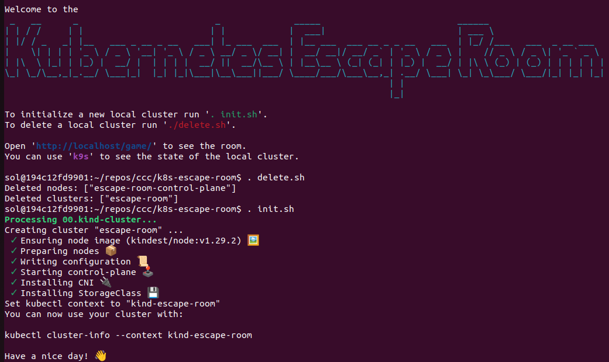
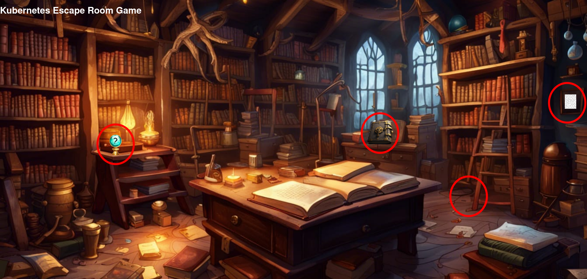

# Local

## Requirements
Docker
```bash
sudo apt install docker.io
```

Docker-Buildx
```bash
sudo apt install docker-buildx
```

add user to Docker group
```bash
sudo usermod -aG docker <user>
su -l <user> # only works in current shell, alternatively login again or restart the system
```

## Setup

```bash
# For local environment
./workbench
. init.sh
```

Wait a short time while everything is being set up.
The setup creates a local Docker-driver vCluster named `escape-room`, exposes its Kubernetes API on host port `18443`, and exposes the escape room ingress on host port `8080`.
It also writes `.kubeconfig` for use from inside the workbench container.



## Play
As soon as the cluster and its resources are ready you can start playing.

The escape room UI is available directly at [http://localhost:8080/](http://localhost:8080/).



## Available tools
* K9s
* kubectl

## Port forwarding

Additional port forwards can still be done from within the workbench container:

```shell
# Forward e.g. port 80 of frontend-service Service to local port 8081:
kubectl port-forward services/frontend-service --address 0.0.0.0 8081:80
```

Expose additional container ports in the matching `workbench` launcher if you want to reach them directly from the host.

**Hint**
Port forwards can also be opened easily via `k9s` in a similar way.
