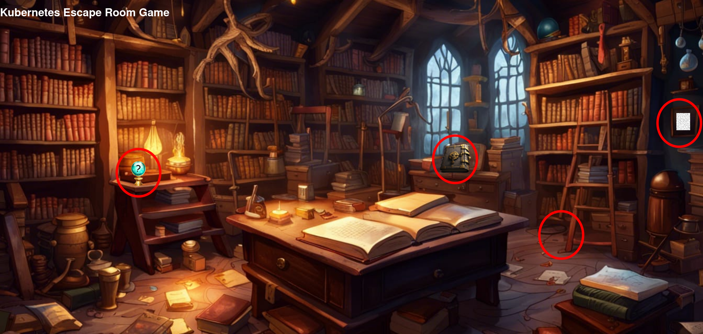

# Local

## Requirements
Docker
```bash
sudo apt install docker.io
```

Docker-Buildx
```bash
sudo apt install docker-buildx
```

add user to Docker group
```bash
sudo usermod -aG docker <user>
su -l <user> # only works in current shell, alternatively login again or restart the system
```

kind network
```bash
docker network create --driver=bridge --subnet=10.172.242.0/24 --ip-range=10.172.242.0/28 --gateway=10.172.242.1 kind
```

**Hint**

If TLS timeout happens e.g. on image pulls there might be a mtu mismatch between the kind network and e.g. a VPN
client (like `Tailscale`). In this case the mtu can be specified as option on the network creation.
Note that the network (and containers which use this network) needs to be recreated if already present.

This configures the `kind` networks with an mtu of `1280`:

```shell
docker network create --driver=bridge --subnet=10.172.242.0/24 --ip-range=10.172.242.0/28 --gateway=10.172.242.1 -o "com.docker.network.driver.mtu"="1280" kind
```

## Setup

```bash
# For local environment
./workbench
. init.sh
```

Wait a short time while everything is being set up.


## Play
As soon as the cluster and its resources are ready you can start playing.

To access the escape room UI in your browser please use [http://localhost/](http://localhost/).



## Available tools
* K9s
* kubectl

## Port forwarding

Port forwards can be done in the following way (within the workplace container):

```shell
# Get IP of the workplace in the kind network
> hostname -I
10.172.242.6
# Forward e.g. port 80 of frontend-service Service to local port 8081 on the kind network host:
kubectl port-forward services/frontend-service --address 0.0.0.0 8081:80
```

The endpoint can then be reached via `<workplace-ip>:8081`.

**Hint**
Port forwards can also be opened easily via `k9s` in a similar way.
