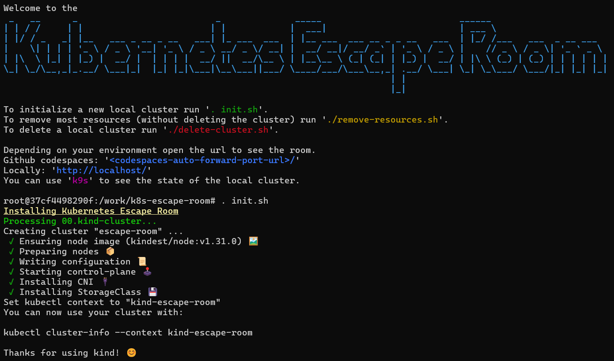

# Local

## Requirements
Docker
```bash
sudo apt install docker.io
```

Docker-Buildx
```bash
sudo apt install docker-buildx
```

add user to Docker group
```bash
sudo usermod -aG docker <user>
su -l <user> # only works in current shell, alternatively login again or restart the system
```

kind network
```bash
docker network create --driver=bridge --subnet=10.172.242.0/24 --ip-range=10.172.242.0/28 --gateway=10.172.242.1 kind
```

## Setup

```bash
# For local environment
./workbench
. init.sh
```

Wait a short time while everything is being set up.



## Play
As soon as the cluster and its resources are ready you can start playing.

To access the escape room UI in your browser please use [http://localhost/game/](http://localhost/game/).
(Right now the last slash is important).

Broken parts in the study are marked with a red circle. 
Hovering there with your cursor gives you a hint for what you might be looking for.


## Available tools
* K9s
* kubectl