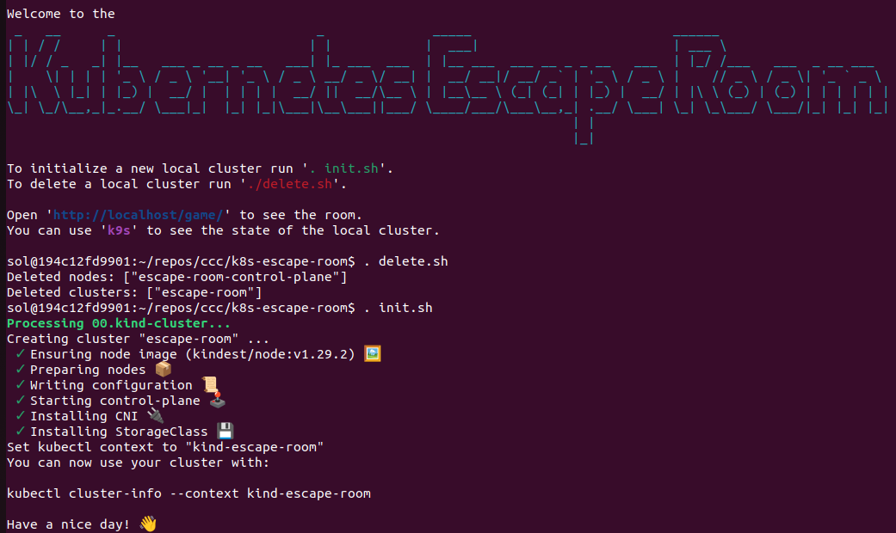
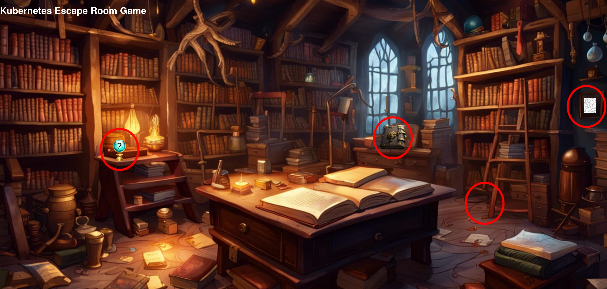

# Kubernetes Escape Room Game

You are a wizard apprentice. While your teacher is out of house you decided to sneak into his study to practice some spells. 
Maybe try out some magic artifacts you find there. 
But while reciting an incantation you found in a hidden tome something went horribly wrong. 
Important things are missing or not working anymore. It is now on you to fix what has been broken.

## Inspired By
[The Great Escape](https://github.com/t-gmn/the-great-escape)

## Requirements

Docker
```bash
sudo apt install docker.io
```

Docker-Buildx
```bash
sudo apt install docker-buildx
```

kind network
```bash
docker network create --driver=bridge --subnet=10.172.242.0/24 --ip-range=10.172.242.0/28 --gateway=10.172.242.1 kind
```

## Setup

```bash
./workbench
. init.sh
```

Wait a short time while everything is being set up.




## Play
As soon as the cluster and its resources are ready you can start playing.
To access the escape room in your browser please use [http://localhost/game/](http://localhost/game/).
(Right now the last slash is important).

Broken parts in the study are marked with a red circle. 
Hovering there with your cursor gives you a hint for what you might be looking for.



All puzzles can be solved through exchanging or adding information.

### Available tools
* K9s
* kubectl
